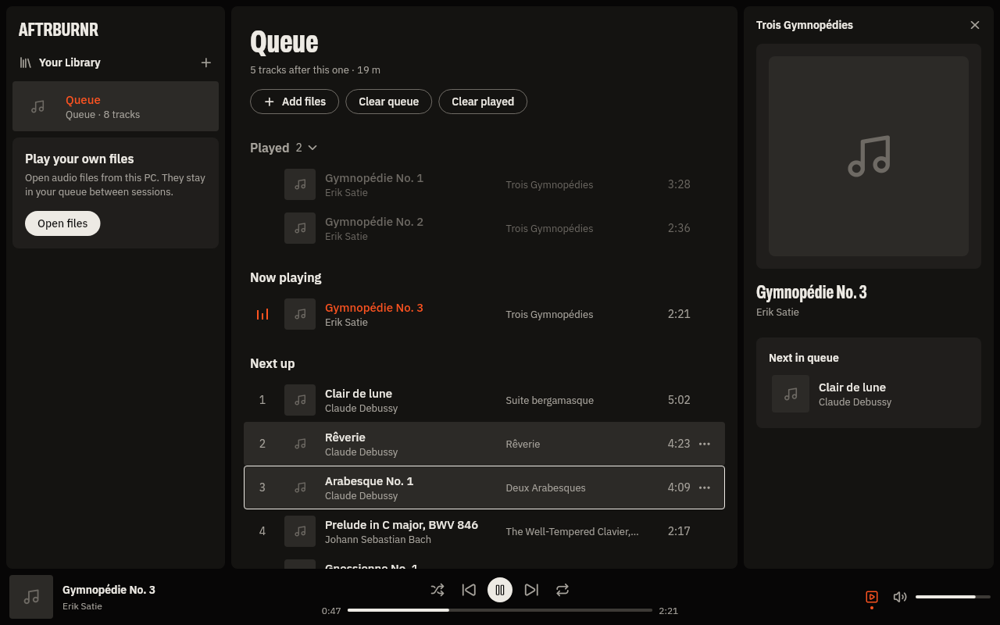

# Step 2 — Audio engine and queue

> **Restyled after review (design spec v2):** the UI now follows Spotify's layout and
> feel — rounded panels on a near-black canvas, "Your Library" on the left, a
> now-playing panel on the right (art on a band of the art's own color, "Next in
> queue"), 56 px rows with art and title over artist, hover-to-play numbers and a `⋯`
> menu, pill buttons, a round play button, a white progress bar that turns flame
> under the pointer. Flame stays the only accent. See [DESIGN.md](../DESIGN.md).

## What works

**Engine (libmpv via media_kit, two decks)**
- Gapless playback: the next track is preloaded into mpv's playlist and joined with no gap.
- Crossfade (engine-level, equal-power, 1–12 s; shortened to ⅓ of very short tracks).
  The setting UI arrives with step 7; the engine path is implemented and tested now.
- Play, pause, seek, volume (perceptual), mute, error reporting per load.
- Hooks for the step-7 DSP: `setAudioFilters` (mpv `af` chain) and `setReplayGain`.

**Queue (pure Dart, immutable)**
- Play now / play next / play last. "Play next" keeps the order you added things in.
- Reorder by drag (single or the whole multi-selection), Alt+↑/↓ to move the selection.
- Multi-select: click, Ctrl-click, Shift-click, Shift+↑/↓, Ctrl+A.
- Remove (Del), "Play next" on rows already queued (Ctrl+Enter), move to end, clear up next,
  clear played.
- Queue history: entries that played this session stay in a collapsible "Played" section
  and can be jumped back to; Previous walks back through them.
- Shuffle, cycled with S or the button:
  - **Random**: Fisher–Yates over `Random.secure()`, every order equally likely; turning it
    off restores the original order around the current track.
  - **Least recently played first**: never-played tracks first, then oldest play first,
    ties random. Uses the local play history.
- Repeat off / queue / track. Repeat-track loops gaplessly.
- Queue, position, shuffle/repeat mode and volume persist in SQLite and come back on
  launch (paused at the saved position).

**Play counting**
- A listen counts after ≥ 30 s or ≥ 50 % actually heard (seeks don't count). Pressing next
  before that records a skip. Stored as `play_events` + per-track `track_stats` for
  step 9 (stats) and step 8 (smart playlists).

**App**
- Desktop shell (v2): library panel, queue page, now-playing panel (toggle in the
  transport bar, remembered; hides on narrow windows and while nothing is loaded),
  transport bar, error strip.
- Queue sections: Played (collapsible), Now playing, Next in queue (play-next entries),
  Next up. Rows can be dragged between sections.
- Open files (Ctrl+O) replaces the queue; Add to queue (Ctrl+Shift+O) appends. Tags and
  embedded cover art are read in a background isolate.
- Files passed on the command line play immediately ("Open with" from Explorer).
- Keyboard: Space, Ctrl+←/→, Shift+←/→ (±10 s), Ctrl+↑/↓ volume, M mute, S shuffle,
  R repeat, media keys while the window has focus.
- Windows runner: dark caption tinted to `bg1` on Windows 11, 1280×800 start size,
  960×600 minimum.

## What I tested

| Suite | Count | What |
|---|---|---|
| `queue_test` | 26 | every queue operation, shuffle uniformity (each of the 6 orders within ±5 % over 60k draws), LRP ordering, un-shuffle, JSON round-trip |
| `player_controller_test` | 13 | controller + fake engine + in-memory SQLite: preload, gapless advance, play vs skip counting, seek exclusion, end of queue, broken tracks, engine errors, previous, repeat-one, remove, reorder, restart restore, LRP from history |
| `engine_mpv_test` | 6 | **real libmpv** (headless, `ao=null`) on ffmpeg-generated FLAC/MP3: tag + art reading, gapless join timing, replacing the preload, crossfade timing, missing-file error, seek/pause |
| `app_widget_test` | 6 | the real UI: empty state, keyboard transport, click/shift-click/Delete, Ctrl+Enter / Alt+↓, shuffle/repeat keys, error strip + dismiss |
| `design_guard_test` | 11 | DESIGN.md §12: no gradients, blur, shadows (except the drag proxy), Material/Cupertino icons, bouncy curves, stray hex colors, Material buttons/ink, motion > 200 ms, radius other than 0/2 |

`flutter analyze`: clean. The libmpv suite ran on Linux in the build container; Windows CI
runs analyze + the other suites + `flutter build windows --release`.

Bugs the tests caught and that are fixed: skip errors were cleared before the user could
see them; row clicks waited 300 ms for a possible double-click (also broke Shift-click);
the context menu had no text style; the selection rule shifted row content by 2 px; MP3
durations from tags can be estimates, so mpv's measured duration now replaces them.

## What is still missing

- No library yet: music only enters through Open files. Folders, scanning and the
  library table are step 3; playlists and "save queue as playlist" are step 4.
- Media keys work only while the window has focus. System media controls (SMTC: the
  Windows volume flyout, global media keys, lock screen) need a native plugin; planned
  with step 7.
- Crossfade, ReplayGain and EQ have engine support but no settings UI until step 7.
- Drag-and-drop of files from Explorer onto the window.
- The command palette (Ctrl+K) arrives with search (step 5), when there is enough to command.
- Not yet verified by a person on a real Windows machine with speakers: CI proves it
  builds; please run it and tell me what you hear.
